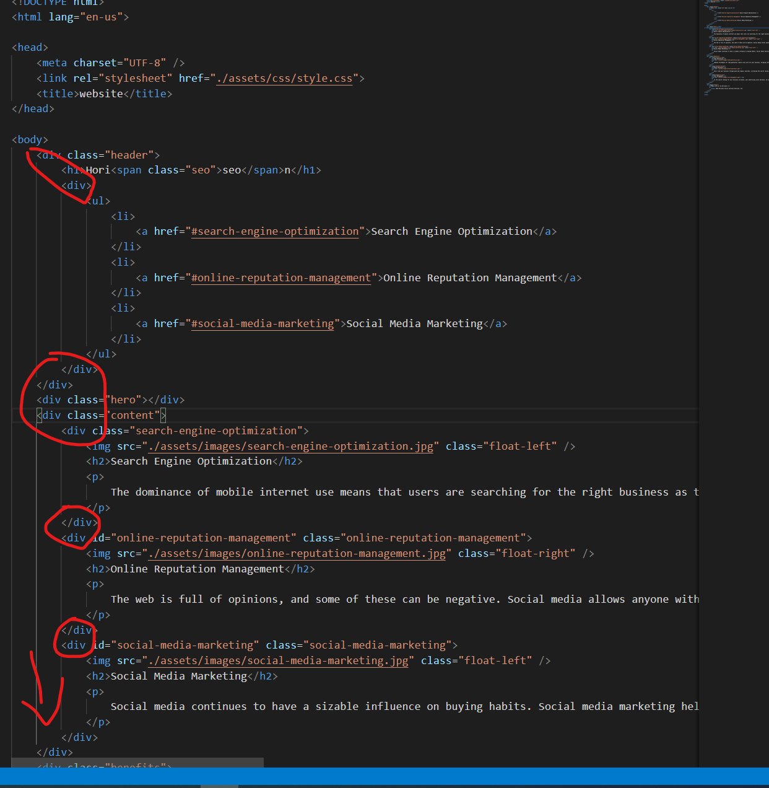
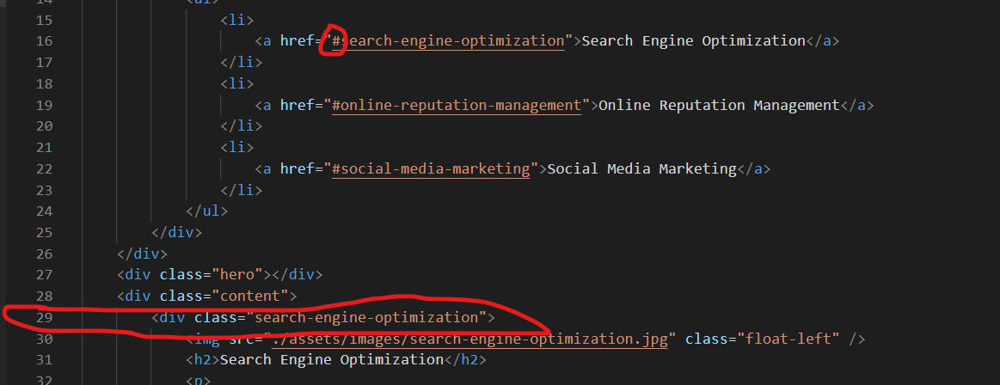
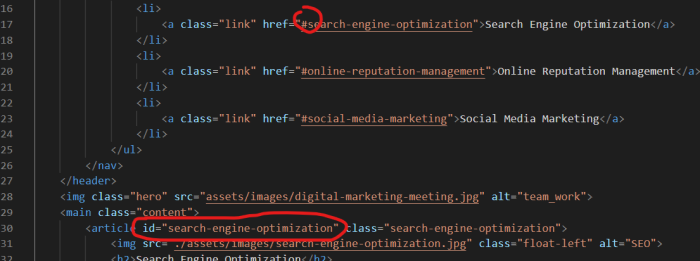
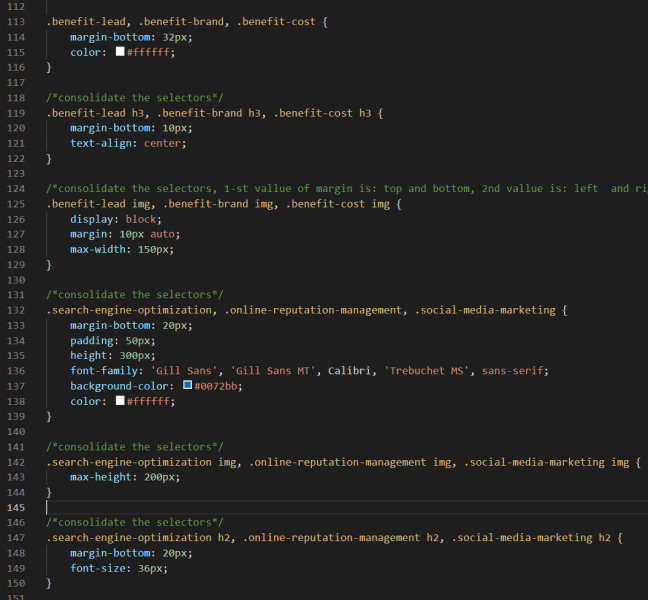

# 1_HW_code_refactor

## Description

This project involves the aspect of accessibility (to refactor an existing site to make it more accessible).

## Things I worked on
* One noticeble aspect in html is that all of the code **is not semantic** written _(when i view a source code then i find semantic HTML elements)_...All around were used _**div** containers_ which makes it less accessible.

* So, first i started to change div containers with more natural html  elments...
like first two div containers i changed with

 _element nav_ inside _header's element_

_articles_ inside _main_ tag element

_articles_ inside _aside_ tag element...
for a logical structure of styling and positioning...

* The first link in _nav bar_ was not working

   **The href** was given by an id (#) but the link had only a class, so I had to add an #id aswell.

   line 29, there is only class present

   line 30, an #id added for the **href** to work

* Weird _div tag_ used to display an image with _CSS_ properties... while there is an ** tag that can be used for that** in html...

* Added some alt attributes for images

* I had to update the css style sheet - no changes for values, only some _properties tag_ had to be changed instead of div with the realated one...

* Also in CSS i have combined some classes since the _vallues_ are the same...

* I've changed the title in a way to be more descriptive and to help users quickly understand the page's content...