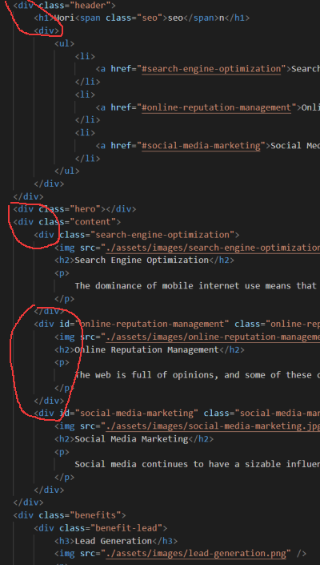

# HW_code_refactor

## Description

This project involves the aspect of accessibility (to refactor an existing site to make it more accessible). HTML and CSS files were cleaned by consolidating elements and structure in a semantic way. 

## Things I worked on HTML file (index.html)
   * One noticeble aspect in html is that all of the code **is not semantic** written _(when i view a source code then i find semantic HTML elements)_...All around were used _**div** containers_ which makes it less accessible.
   * So, first i started to change div containers with more natural html elments...
like first two div containers i changed with

      >_element nav_ inside _header's element_

      >_articles_ inside _main_ tag element

      >_articles_ inside _aside_ tag element...

   for a logical structure of styling and positioning...

   * Weird _div tag_ used to display an image with _CSS_ properties... while there is an **"img" tag that can be used for that** in html...
   * Added alt attributes for images
   * The first link in _nav bar_ was not working
   * **The href** was given by an id (#) but the link had only a class, so I had to add an #id aswell.
   * line 29, there is only class present
   * line 30, an #id added for the **href** to work

## Things I worked on CSS file (style.css)
   * I had to update the css style sheet - no changes for values, only some _properties tag_ had to be changed instead of div with the realated one...
   * Combined some classes since the _vallues_ are the same...
   * img source deleted since we referenced/linked it in index.html

## Some more *touch-ups*
   * I've changed the title in a way to be more descriptive and to help users quickly understand the page's content...
   * Added meta name
   * Used an icon for webpage
   * In CSS a _"scroll-behavior"_ to smooth was added and _link:hover_.

## Sources
   * >[w3schools](https://www.w3schools.com/)
   * >[MDN](https://developer.mozilla.org/en-US/)
   * >[GitHub](https://github.com/)
   * >[stack**overflow**](https://stackoverflow.com/)

## Directory:
   * >["deployed" Horiseon Website](https://victorcodrean.github.io/1_HW_code_refactor/)
   * >[GitHub repository link](https://github.com/VictorCodrean/1_HW_code_refactor)

## Note
   -I noticed the website is not responsive, that will be on to do list...