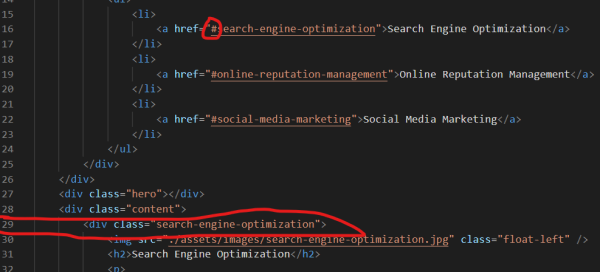

# 1_HW_code_refactor

## Description

This project involves the aspect of accessibility (to refactor an existing site to make it more accessible).

## Things I worked on
* One noticeble aspect in html is that all of the code **is not semantic** written _(when i view a source code then i find semantic HTML elements)_...All around were used _**div** containers_ which makes it less accessible.

```md

* So, first i started to change div containers with more natural html  elments...
like first two div containers i changed with _element nav_ inside _header's element_
_articles_ inside _main_ tag element
_articles_ inside _aside_ tag element...
for a logical structure of styling and positioning...

* The first link in _nav bar_ was not working
```md



* Weird _div tag_ used to display an image while there is an ** tag that can be used for that**...

* Added some alt attributes to images

* I had to update the css style sheet - no changes for values, but some _properties tag_ had to be changed instead of div with the realated one...

* Also in CSS i have combined some classes since the _vallues_ are the same...

* I've changed the title in a way to be more descriptive and to help users quickly understand the page's content...